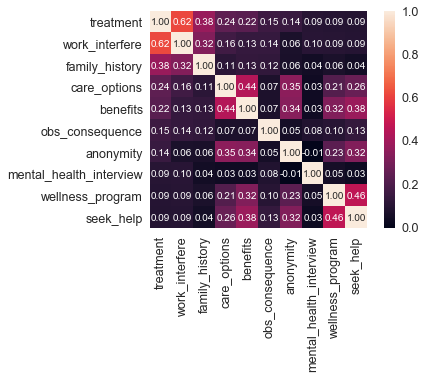

## Table of Contents  
* Part I: Research background  
* Part II: Data Description  
* Part III: Data Processing  
* Part IV: Data Visualization
* Part V: Machine Learning
* Part VI: Analysis Results  
   
   
   
   
   
   
## Part I: Research background  
The data comes from the osmi website, the full name of Open Sourcing Mental Illness. The survey data used this time is a 2014 questionnaire, about the mental health status of people in the field of science and technology, and more than 1,200 survey results.
  
  
  
  
  
  
## Part II: Data Description   
>Age  
>Gender  
>Country   
>Self_employed: Whether self-employed  
>Family_history: Is there a family history of mental illness?  
>Treatment : whether it has been treated (subsequent main analysis fields)  
>Work_interfere: Does the disease affect work?  
>No_employees: number of employees  
>Remote_work : Whether to work outside for a long time  
>Tech_company : Is it a technology company?  
>Benefits: Does your employer provide mental health benefits?  
>Care_options: Your employer offers a choice of mental health care  
>Wellness_program: Discuss mental health as part of an employee health plan?  
>Seek_help: Does your employer provide resources to learn more about mental health issues?  
>Anonymity: Is there treatment for anonymous protection?  
>Leave: Is it easy to leave medication?  
>Mental_health_consequence : Discuss with employers whether mental health has an adverse effect  
>Phys_health_consequence: Discuss with employers whether physical health has an adverse effect  
>Coworkers: Willing to discuss with colleagues?  
>Supervisor: Will you discuss with your immediate supervisor?  
>Mental_health_interview: Will mental health be discussed during the interview?  
>Phys_health_interview: Will you discuss your health during the interview?  
>Mental_vs_physical: Does the employer think that mental health is as important as physical health?  
>Obs_consequence: Has your colleague been affected by mental health?  
>Comments  
>Timestamp  
>State  
  
  
  
  
  
  
## Part III: Data Processing   

### Import data packets and see the data structure
	import numpy as np # linear algebra
	import pandas as pd # data processing, CSV file I/O (e.g. pd.read_csv)
	import matplotlib.pyplot as plt
	%matplotlib inline
	import seaborn as sns

	from scipy import stats
	from scipy.stats import randint

	from sklearn.model_selection import train_test_split
	from sklearn import preprocessing
	from sklearn.datasets import make_classification
	from sklearn.preprocessing import binarize, LabelEncoder, MinMaxScaler

	#Training model, preparing for normalization 
	from sklearn.linear_model import LogisticRegression
	from sklearn.tree import DecisionTreeClassifier
	from sklearn.ensemble import RandomForestClassifier, ExtraTreesClassifier

	#Import model 
	from sklearn import metrics
	from sklearn.metrics import accuracy_score, mean_squared_error, precision_recall_curve
	from sklearn.model_selection import cross_val_score

	#Neural Networks
	from sklearn.neural_network import MLPClassifier
	from sklearn.grid_search import RandomizedSearchCV

	#Bagging
	from sklearn.ensemble import BaggingClassifier, AdaBoostClassifier
	from sklearn.neighbors import KNeighborsClassifier

	#Naive bayes
	from sklearn.naive_bayes import GaussianNB 

	#Stacking
	from mlxtend.classifier import StackingClassifier

	#reading data
	train_df = pd.read_csv('../input/survey.csv')

	#browsing data
	print(train_df.shape)
	print(train_df.describe())
	print(train_df.info())

#### Delete useless fields "Timestamp", "comments", "state"

	train_df = train_df.drop(['comments'], axis= 1)
	train_df = train_df.drop(['state'], axis= 1)
	train_df = train_df.drop(['Timestamp'], axis= 1)

	train_df.isnull().sum().max() #just checking that there's no missing data missing...
	train_df.head(5)

#### Unified data value
	
	#Default data
	defaultInt = 0
	defaultString = 'NaN'
	defaultFloat = 0.0

	#Fields to be processed
	intFeatures = ['Age']
	stringFeatures = ['Gender', 'Country', 'self_employed', 'family_history', 'treatment', 'work_interfere',
	                 'no_employees', 'remote_work', 'tech_company', 'anonymity', 'leave', 'mental_health_consequence',
	                 'phys_health_consequence', 'coworkers', 'supervisor', 'mental_health_interview', 'phys_health_interview',
	                 'mental_vs_physical', 'obs_consequence', 'benefits', 'care_options', 'wellness_program',
	                 'seek_help']
	floatFeatures = []

	#Clear Nan
	for feature in train_df:
	    if feature in intFeatures:
	        train_df[feature] = train_df[feature].fillna(defaultInt)
	    elif feature in stringFeatures:
	        train_df[feature] = train_df[feature].fillna(defaultString)
	    elif feature in floatFeatures:
	        train_df[feature] = train_df[feature].fillna(defaultFloat)
	    else:
	        print('Error: Feature %s not recognized.' % feature)
	train_df.head(5)  

	#Clean the data of 'Gender'
	gender = train_df['Gender'].str.lower()
	gender = train_df['Gender'].unique()

	#Text data standardization
	male_str = ["male", "m", "male-ish", "maile", "mal", "male (cis)", "make", "male ", "man","msle", "mail", "malr","cis man", "Cis Male", "cis male"]
	trans_str = ["trans-female", "something kinda male?", "queer/she/they", "non-binary","nah", "all", "enby", "fluid", "genderqueer", "androgyne", "agender", "male leaning androgynous", "guy (-ish) ^_^", "trans woman", "neuter", "female (trans)", "queer", "ostensibly male, unsure what that really means"]           
	female_str = ["cis female", "f", "female", "woman",  "femake", "female ","cis-female/femme", "female (cis)", "femail"]

	for (row, col) in train_df.iterrows():
	    if str.lower(col.Gender) in male_str:
	        train_df['Gender'].replace(to_replace=col.Gender, value='male', inplace=True)
	    if str.lower(col.Gender) in female_str:
	        train_df['Gender'].replace(to_replace=col.Gender, value='female', inplace=True)
	    if str.lower(col.Gender) in trans_str:
	        train_df['Gender'].replace(to_replace=col.Gender, value='trans', inplace=True)

	#Additional text is processed separately
	stk_list = ['A little about you', 'p']
	train_df = train_df[~train_df['Gender'].isin(stk_list)]
	
	print(train_df['Gender'].unique())

	#Cleaning 'Age' data
	train_df['Age'].fillna(train_df['Age'].median(), inplace = True)

	#If the age is less than 18 or greater than 120, replace it with the average
	s = pd.Series(train_df['Age'])
	s[s<18] = train_df['Age'].median()
	train_df['Age'] = s
	s = pd.Series(train_df['Age'])
	s[s>120] = train_df['Age'].median()
	train_df['Age'] = s

	#Age segmentation
	train_df['age_range'] = pd.cut(train_df['Age'], [0,20,30,65,100], labels=["0-20", "21-30", "31-65", "66-100"], include_lowest=True)
	

        #Cleaning the data of 'self_employed'
	#Since only 0.014% of self-employed people, use NOT self_employed instead of NaN
	train_df['self_employed'] = train_df['self_employed'].replace([defaultString], 'No')
	print(train_df['self_employed'].unique())

	#Clean the data of 'work_interfere'
	#Since only 0.20% of self work_interfere, use "Don't know instead of NaN
	train_df['work_interfere'] = train_df['work_interfere'].replace([defaultString], 'Don\'t know' )
	print(train_df['work_interfere'].unique())

#### Data normalization

	#Data encoding
	labelDict = {}
	for feature in train_df:
	    le = preprocessing.LabelEncoder()
	    le.fit(train_df[feature])
	    le_name_mapping = dict(zip(le.classes_, le.transform(le.classes_)))
	    train_df[feature] = le.transform(train_df[feature])
	    # Get labels
	    labelKey = 'label_' + feature
	    labelValue = [*le_name_mapping]
	    labelDict[labelKey] =labelValue
	    
	for key, value in labelDict.items():     
	    print(key, value)

	#Delete column 'Country'
	train_df = train_df.drop(['Country'], axis= 1)
	train_df.head()

	#See if there are still missing data
	total = train_df.isnull().sum().sort_values(ascending=False)
	percent = (train_df.isnull().sum()/train_df.isnull().count()).sort_values(ascending=False)
	missing_data = pd.concat([total, percent], axis=1, keys=['Total', 'Percent'])
	missing_data.head(20)
	print(missing_data)

## Part IV: Data Visualization
### 1.Explore the relationship between data

	#Covariance matrix
	corrmat = train_df.corr()
	f, ax = plt.subplots(figsize=(12, 9))
	sns.heatmap(corrmat, vmax=.8, square=True);
	plt.show()

	#Processing matrix
	k = 10 #Select 10 factors with the 10 closest correlations
	cols = corrmat.nlargest(k, 'treatment')['treatment'].index
	cm = np.corrcoef(train_df[cols].values.T)
	sns.set(font_scale=1.25)
	hm = sns.heatmap(cm, cbar=True, annot=True, square=True, fmt='.2f', annot_kws={'size': 10}, yticklabels=cols.values, xticklabels=cols.values)
	plt.show()

### 2.Age distribution and density distribution
	plt.figure(figsize=(12,8))
	sns.distplot(train_df["Age"], bins=24)
	plt.title("Distribuition and density by Age")
	plt.xlabel("Age")

### 3.Age distribution under treatment
	g = sns.FacetGrid(train_df, col='treatment', size=5)
	g = g.map(sns.distplot, "Age")

### 4.Number of people who have received treatment
	plt.figure(figsize=(12,8))
	labels = labelDict['label_Gender']
	g = sns.countplot(x="treatment", data=train_df)
	g.set_xticklabels(labels)

	plt.title('Total Distribuition by treated or not')	

### 5.Summary of age and gender distribution
	o = labelDict['label_age_range']

	g = sns.factorplot(x="age_range", y="treatment", hue="Gender", data=train_df, kind="bar",  ci=None, size=5, aspect=2, legend_out = True)
	g.set_xticklabels(o)

	plt.title('Probability of mental health condition')
	plt.ylabel('Probability x 100')
	plt.xlabel('Age')
	
	# Replace legend label
	new_labels = labelDict['label_Gender']
	for t, l in zip(g._legend.texts, new_labels): t.set_text(l)

	g.fig.subplots_adjust(top=0.9,right=0.8)
	plt.show()

### 6.Summary distribution of gender and family history
	o = labelDict['label_family_history']
	g = sns.factorplot(x="family_history", y="treatment", hue="Gender", data=train_df, kind="bar", ci=None, size=5, aspect=2, legend_out = True)
	g.set_xticklabels(o)
	plt.title('Probability of mental health condition')
	plt.ylabel('Probability x 100')
	plt.xlabel('Family History')

	# Replace legend label
	new_labels = labelDict['label_Gender']
	for t, l in zip(g._legend.texts, new_labels): t.set_text(l)

	g.fig.subplots_adjust(top=0.9,right=0.8)
	plt.show()

### 7.Provide mental health care and gender summary distribution
	o = labelDict['label_care_options']
	g = sns.factorplot(x="care_options", y="treatment", hue="Gender", data=train_df, kind="bar", ci=None, size=5, aspect=2, legend_out = True)
	g.set_xticklabels(o)
	plt.title('Probability of mental health condition')
	plt.ylabel('Probability x 100')
	plt.xlabel('Care options')

	# Replace legend label
	new_labels = labelDict['label_Gender']
	for t, l in zip(g._legend.texts, new_labels): t.set_text(l)

	g.fig.subplots_adjust(top=0.9,right=0.8)
	plt.show()

### 8.Provide mental health benefits and gender distribution
	o = labelDict['label_benefits']
	g = sns.factorplot(x="care_options", y="treatment", hue="Gender", data=train_df, kind="bar", ci=None, size=5, aspect=2, legend_out = True)
	g.set_xticklabels(o)
	plt.title('Probability of mental health condition')
	plt.ylabel('Probability x 100')
	plt.xlabel('Benefits')

	# Replace legend label
	new_labels = labelDict['label_Gender']
	for t, l in zip(g._legend.texts, new_labels): t.set_text(l)

	g.fig.subplots_adjust(top=0.9,right=0.8)
	plt.show()

### 9.Work impact and gender summary distribution
	o = labelDict['label_work_interfere']
	g = sns.factorplot(x="work_interfere", y="treatment", hue="Gender", data=train_df, kind="bar", ci=None, size=5, aspect=2, legend_out = True)
	g.set_xticklabels(o)
	plt.title('Probability of mental health condition')
	plt.ylabel('Probability x 100')
	plt.xlabel('Work interfere')

	# Replace legend label
	new_labels = labelDict['label_Gender']
	for t, l in zip(g._legend.texts, new_labels): t.set_text(l)

	g.fig.subplots_adjust(top=0.9,right=0.8)
	plt.show()

## Part V: Machine Learning
### Scaling and fitting

	# Scale with the "Age" feature because it is different from other fields
	scaler = MinMaxScaler()
	train_df['Age'] = scaler.fit_transform(train_df[['Age']])
	train_df.head()

	# Separate data set
	feature_cols = ['Age', 'Gender', 'family_history', 'benefits', 'care_options', 'anonymity', 'leave', 'work_interfere']
	X = train_df[feature_cols]
	y = train_df.treatment

	X_train, X_test, y_train, y_test = train_test_split(X, y, test_size=0.30, random_state=0)

	# Create a dictionary to use as the final graphic summary
	methodDict = {}
	rmseDict = ()

	# Establish forest and calculate the importance of features
	forest = ExtraTreesClassifier(n_estimators=250,random_state=0)

	forest.fit(X, y)
	importances = forest.feature_importances_
	std = np.std([tree.feature_importances_ for tree in forest.estimators_],axis=0)
	indices = np.argsort(importances)[::-1]

	labels = []
	for f in range(X.shape[1]):
	    labels.append(feature_cols[f])      
	    
	plt.figure(figsize=(12,8))
	plt.title("Feature importances")
	plt.bar(range(X.shape[1]), importances[indices],
	       color="r", yerr=std[indices], align="center")
	plt.xticks(range(X.shape[1]), labels, rotation='vertical')
	plt.xlim([-1, X.shape[1]])
	plt.show()

### Classification model evaluation

	def evalClassModel(model, y_test, y_pred_class, plot=False):
	    # Classification accuracy
	    print('Accuracy:', metrics.accuracy_score(y_test, y_pred_class))
	    
	    #NULL accuracy
	    # examine the class distribution of the testing set (using a Pandas Series method)
	    print('Null accuracy:\n', y_test.value_counts())
	    
	    # percentage of ones
	    print('Percentage of ones:', y_test.mean())
	    
	    # percentage of zeros
	    print('Percentage of zeros:',1 - y_test.mean())
	    
	    #Compare real and predicted responses
	    print('True:', y_test.values[0:25])
	    print('Pred:', y_pred_class[0:25])
	    
	    #Confusion matrix
	    confusion = metrics.confusion_matrix(y_test, y_pred_class)
	    #[Row, column]
	    TP = confusion[1, 1]
	    TN = confusion[0, 0]
	    FP = confusion[0, 1]
	    FN = confusion[1, 0]
	    
	    # Visual confusion matrix
	    sns.heatmap(confusion,annot=True,fmt="d") 
	    plt.title('Confusion Matrix')
	    plt.xlabel('Predicted')
	    plt.ylabel('Actual')
	    plt.show()
	    
	    #Calculate metrics based on confusion matrix
	    #Classification Accuracy: Overall, how often is the classifier correct?
	    accuracy = metrics.accuracy_score(y_test, y_pred_class)
	    print('Classification Accuracy:', accuracy)
	    
	    #Classification error score
	    print('Classification Error:', 1 - metrics.accuracy_score(y_test, y_pred_class))
	    
	    #False Positive Rate
	    false_positive_rate = FP / float(TN + FP)
	    print('False Positive Rate:', false_positive_rate)
	    
	    #Precision
	    print('Precision:', metrics.precision_score(y_test, y_pred_class))
	  
	    # AUC Score
	    print('AUC Score:', metrics.roc_auc_score(y_test, y_pred_class))
	    
	    # Cross-validated AUC
	    print('Cross-validated AUC:', cross_val_score(model, X, y, cv=10, scoring='roc_auc').mean())
	    
	
### Adjust classification threshold
	    
	    # Print the top 10 predicted values and classification membership probability
	    print('First 10 predicted responses:\n', model.predict(X_test)[0:10])
	    print('First 10 predicted probabilities of class members:\n', model.predict_proba(X_test)[0:10])

	    # Print the first 10 predicted probabilities of category 1 and save
	    model.predict_proba(X_test)[0:10, 1]
	    y_pred_prob = model.predict_proba(X_test)[:, 1]
	    
	    if plot == True:
	        # Histogram visual prediction probability
	        plt.rcParams['font.size'] = 12
	        plt.hist(y_pred_prob, bins=8)
	        
	        plt.xlim(0,1)
	        plt.title('Histogram of predicted probabilities')
	        plt.xlabel('Predicted probability of treatment')
	        plt.ylabel('Frequency')
	    
	    
	    # Predictive treatment if the predicted probability is greater than 0.3
	    y_pred_prob = y_pred_prob.reshape(-1,1) 
	    y_pred_class = binarize(y_pred_prob, 0.3)[0]
	    
	    # Print the first 10 predicted values
	    print('First 10 predicted probabilities:\n', y_pred_prob[0:10])
	    
	
### ROC curve and area under the curve (AUC)
	    
	    roc_auc = metrics.roc_auc_score(y_test, y_pred_prob)
	    
	    # roc_curve Return 3 objects, false positive rate, true positive rate and threshold
	    fpr, tpr, thresholds = metrics.roc_curve(y_test, y_pred_prob)
	    if plot == True:
	        plt.figure()
	        
	        plt.plot(fpr, tpr, color='darkorange', label='ROC curve (area = %0.2f)' % roc_auc)
	        plt.plot([0, 1], [0, 1], color='navy', linestyle='--')
	        plt.xlim([0.0, 1.0])
	        plt.ylim([0.0, 1.0])
	        plt.rcParams['font.size'] = 12
	        plt.title('ROC curve for treatment classifier')
	        plt.xlabel('False Positive Rate (1 - Specificity)')
	        plt.ylabel('True Positive Rate (Sensitivity)')
	        plt.legend(loc="lower right")
	        plt.show()
	    
	    # Define a function that accepts thresholds and prints sensitivity and specificity
	    def evaluate_threshold(threshold):
	        print('Specificity for ' + str(threshold) + ' :', 1 - fpr[thresholds > threshold][-1])

	    # Set threshold
	    predict_mine = np.where(y_pred_prob > 0.50, 1, 0)
	    confusion = metrics.confusion_matrix(y_test, predict_mine)
	    print(confusion)

	    return accuracy

### Adjust using cross-validation scores

	def tuningCV(knn):
	    
	    # Search for the best value of K for KNN
	    k_range = list(range(1, 31))
	    k_scores = []
	    for k in k_range:
	        knn = KNeighborsClassifier(n_neighbors=k)
	        scores = cross_val_score(knn, X, y, cv=10, scoring='accuracy')
	        k_scores.append(scores.mean())
	    print(k_scores)

	    plt.plot(k_range, k_scores)
	    plt.xlabel('Value of K for KNN')
	    plt.ylabel('Cross-Validated Accuracy')
	    plt.show()

### Adjust using GridSearchCV

	    def tuningGridSerach(knn):
	    # define the parameter values that should be searched
	    k_range = list(range(1, 31))
	    print(k_range)
	    
	    # create a parameter grid
	    param_grid = dict(n_neighbors=k_range)
	    print(param_grid)
	    
	    # fit the grid with data
	    grid = GridSearchCV(knn, param_grid, cv=10, scoring='accuracy')
	    grid.fit(X, y)
	    # view the complete results (list of named tuples)
	    grid.grid_scores_
	    
	    # examine the first tuple
	    print(grid.grid_scores_[0].parameters)
	    print(grid.grid_scores_[0].cv_validation_scores)
	    print(grid.grid_scores_[0].mean_validation_score)
	    
	    # create a list of the mean scores only
	    grid_mean_scores = [result.mean_validation_score for result in grid.grid_scores_]
	    print(grid_mean_scores)
	    
	    plt.plot(k_range, grid_mean_scores)
	    plt.xlabel('Value of K for KNN')
	    plt.ylabel('Cross-Validated Accuracy')
	    plt.show()
	    
	    # examine the best model
	    print('GridSearch best score', grid.best_score_)
	    print('GridSearch best params', grid.best_params_)
	    print('GridSearch best estimator', grid.best_estimator_)

### Adjust using tuningRandomizedSearchCV

	    def tuningRandomizedSearchCV(model, param_dist):
	    #Searching multiple parameters simultaneously
	    rand = RandomizedSearchCV(model, param_dist, cv=10, scoring='accuracy', n_iter=10, random_state=5)
	    rand.fit(X, y)
	    rand.grid_scores_
	    
	    # examine the best model
	    print('Rand. Best Score: ', rand.best_score_)
	    print('Rand. Best Params: ', rand.best_params_)
	    
	    # run RandomizedSearchCV 20 times (with n_iter=10) and record the best score
	    best_scores = []
	    for _ in range(20):
	        rand = RandomizedSearchCV(model, param_dist, cv=10, scoring='accuracy', n_iter=10)
	        rand.fit(X, y)
	        best_scores.append(round(rand.best_score_, 3))
	    print(best_scores)

### Adjust using tuningMultParam

	    def tuningMultParam(knn):
	    
	    #Searching multiple parameters simultaneously
	    # define the parameter values that should be searched
	    k_range = list(range(1, 31))
	    weight_options = ['uniform', 'distance']
	        
	    # create a parameter grid: map the parameter names to the values that should be searched
	    param_grid = dict(n_neighbors=k_range, weights=weight_options)
	    print(param_grid) 
	    
	    # instantiate and fit the grid
	    grid = GridSearchCV(knn, param_grid, cv=10, scoring='accuracy')
	    grid.fit(X, y) 
	    
	    # view the complete results
	    print(grid.grid_scores_)
	    
	    # examine the best model
	    print('Multiparam. Best Score: ', grid.best_score_)
	    print('Multiparam. Best Params: ', grid.best_params_)

### Evaluating models
#### 1.Logistic Regression

	    def logisticRegression():
	    # train a logistic regression model on the training set
	    logreg = LogisticRegression()
	    logreg.fit(X_train, y_train)
	    
	    # make class predictions for the testing set
	    y_pred_class = logreg.predict(X_test)
	    
	    print('########### Logistic Regression ###############')
	    
	    accuracy_score = evalClassModel(logreg, y_test, y_pred_class, True)
	    
	    #Data for final graph
	    methodDict['Log. Regres.'] = accuracy_score * 100

	    logisticRegression()

#### 2.KNeighbors Classifier

	    def Knn():
	    # Calculating the best parameters
	    knn = KNeighborsClassifier(n_neighbors=5)
	    
	    
	    # define the parameter values that should be searched
	    k_range = list(range(1, 31))
	    weight_options = ['uniform', 'distance']
	    
	    # specify "parameter distributions" rather than a "parameter grid"
	    param_dist = dict(n_neighbors=k_range, weights=weight_options)
	    tuningRandomizedSearchCV(knn, param_dist)
	    
	    # train a KNeighborsClassifier model on the training set
	    knn = KNeighborsClassifier(n_neighbors=27, weights='uniform')
	    knn.fit(X_train, y_train)
	    
	    # make class predictions for the testing set
	    y_pred_class = knn.predict(X_test)
	    
	    print('########### KNeighborsClassifier ###############')
	    
	    accuracy_score = evalClassModel(knn, y_test, y_pred_class, True)

	    #Data for final graph
	    methodDict['KNN'] = accuracy_score * 100

	    Knn()

#### 3.Decision Tree classifier

	    def treeClassifier():
	    # Calculating the best parameters
	    tree = DecisionTreeClassifier()
	    featuresSize = feature_cols.__len__()
	    param_dist = {"max_depth": [3, None],
	              "max_features": randint(1, featuresSize),
	              "min_samples_split": randint(2, 9),
	              "min_samples_leaf": randint(1, 9),
	              "criterion": ["gini", "entropy"]}
	    tuningRandomizedSearchCV(tree, param_dist)
	    
	    # train a decision tree model on the training set
	    tree = DecisionTreeClassifier(max_depth=3, min_samples_split=8, max_features=6, criterion='entropy', min_samples_leaf=7)
	    tree.fit(X_train, y_train)
	    
	    # make class predictions for the testing set
	    y_pred_class = tree.predict(X_test)
	    
	    print('########### Tree classifier ###############')
	    
	    accuracy_score = evalClassModel(tree, y_test, y_pred_class, True)

	    #Data for final graph
	    methodDict['Tree clas.'] = accuracy_score * 100

	    treeClassifier()

#### 4.Random Forests

	    def randomForest():
	    # Calculating the best parameters
	    forest = RandomForestClassifier(n_estimators = 20)

	    featuresSize = feature_cols.__len__()
	    param_dist = {"max_depth": [3, None],
	              "max_features": randint(1, featuresSize),
	              "min_samples_split": randint(2, 9),
	              "min_samples_leaf": randint(1, 9),
	              "criterion": ["gini", "entropy"]}
	    tuningRandomizedSearchCV(forest, param_dist)
	    
	    # Building and fitting my_forest
	    forest = RandomForestClassifier(max_depth = None, min_samples_leaf=8, min_samples_split=2, n_estimators = 20, random_state = 1)
	    my_forest = forest.fit(X_train, y_train)
	    
	    # make class predictions for the testing set
	    y_pred_class = my_forest.predict(X_test)
	    
	    print('########### Random Forests ###############')
	    
	    accuracy_score = evalClassModel(my_forest, y_test, y_pred_class, True)

	    #Data for final graph
	    methodDict['R. Forest'] = accuracy_score * 100

	    randomForest()
	    
#### 5.bagging

	    def bagging():
	    # Building and fitting 
	    bag = BaggingClassifier(DecisionTreeClassifier(), max_samples=1.0, max_features=1.0, bootstrap_features=False)
	    bag.fit(X_train, y_train)
	    
	    # make class predictions for the testing set
	    y_pred_class = bag.predict(X_test)
	    
	    print('########### Bagging ###############')
	    
	    accuracy_score = evalClassModel(bag, y_test, y_pred_class, True)

	    #Data for final graph
	    methodDict['Bagging'] = accuracy_score * 100

	    bagging()

#### 6.boosting

	    def boosting():
	    # Building and fitting 
	    clf = DecisionTreeClassifier(criterion='entropy', max_depth=1)
	    boost = AdaBoostClassifier(base_estimator=clf, n_estimators=500)
	    boost.fit(X_train, y_train)
	    
	    # make class predictions for the testing set
	    y_pred_class = boost.predict(X_test)
	    
	    print('########### Boosting ###############')
	    
	    accuracy_score = evalClassModel(boost, y_test, y_pred_class, True)

	    #Data for final graph
	    methodDict['Boosting'] = accuracy_score * 100

	    boosting()

#### 7.stacking

	    def stacking():
	    # Building and fitting 
	    clf1 = KNeighborsClassifier(n_neighbors=1)
	    clf2 = RandomForestClassifier(random_state=1)
	    clf3 = GaussianNB()
	    lr = LogisticRegression()
	    stack = StackingClassifier(classifiers=[clf1, clf2, clf3], meta_classifier=lr)
	    stack.fit(X_train, y_train)
	    
	    # make class predictions for the testing set
	    y_pred_class = stack.predict(X_test)
	    
	    print('########### Stacking ###############')
	    
	    accuracy_score = evalClassModel(stack, y_test, y_pred_class, True)

	    #Data for final graph
	    methodDict['Stacking'] = accuracy_score * 100

	    stacking()
